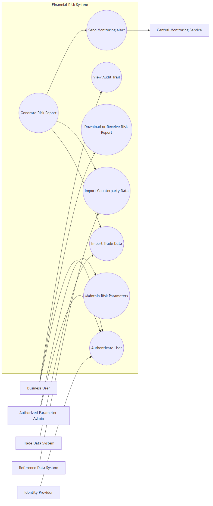
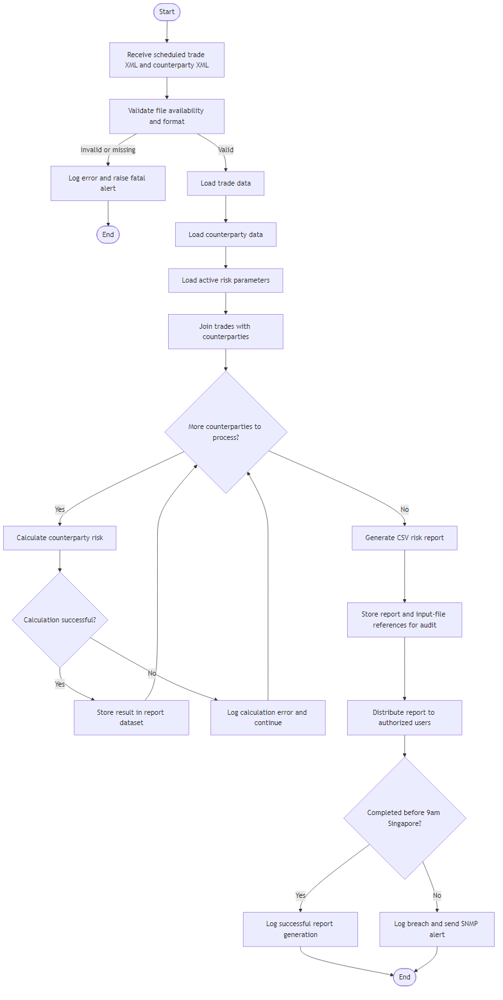
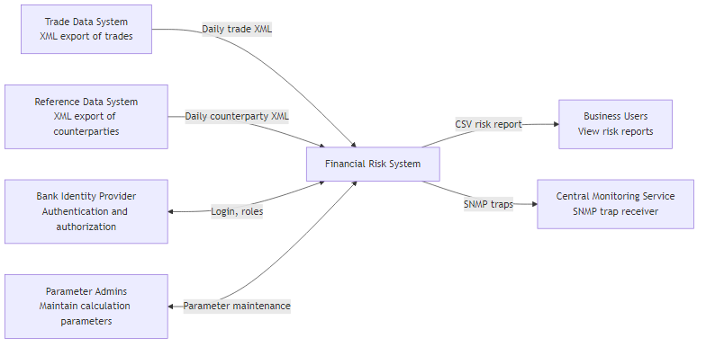
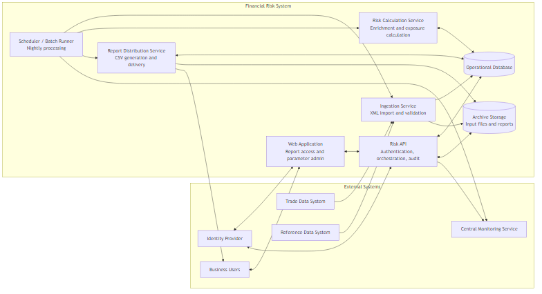
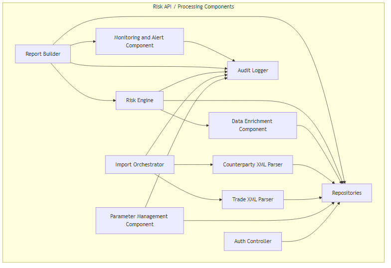
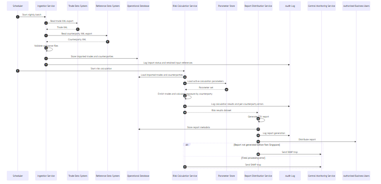

# Financial Risk System

## Overview

The Financial Risk System imports end-of-day trade and counterparty data, enriches the data, calculates exposure by counterparty, generates an Excel-compatible risk report, distributes it to authorized business users before 9am Singapore time, and allows privileged users to maintain the calculation parameters.

## Key Assumptions

- The Trade Data System and Reference Data System provide XML files as scheduled end-of-day exports.
- The report is distributed as a CSV file so it can be imported into Microsoft Excel.
- Authentication and authorization are handled centrally through the bank identity platform.
- Monitoring alerts are sent to the Central Monitoring Service through SNMP traps.
- Input files and report-generation metadata are retained for one year for audit and traceability.

## A. Use Case Diagram

## B. Activity Diagram: Create Risk Report

## C. Context Diagram

## D. Container Diagram

## E. Component Diagram

## F. Sequence Diagram: Create Risk Report

## Notes

- Counterparty calculation failures are logged individually so the overall batch can continue.
- Audit records should include the exact input files, parameter version, generation timestamp, and report identifier.
- Archive storage retains input XML files and generated reports for one year.
